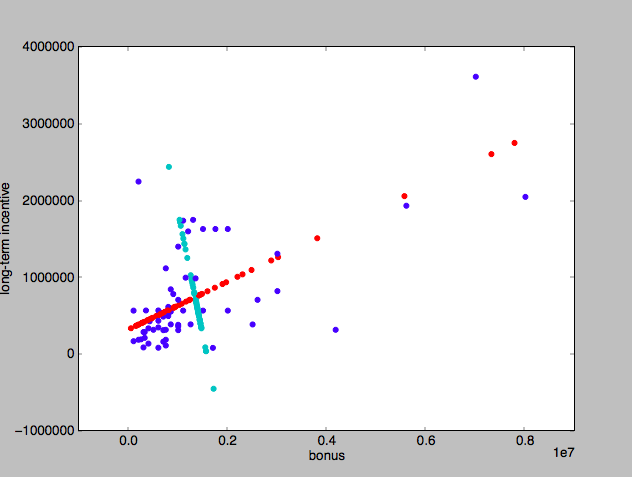
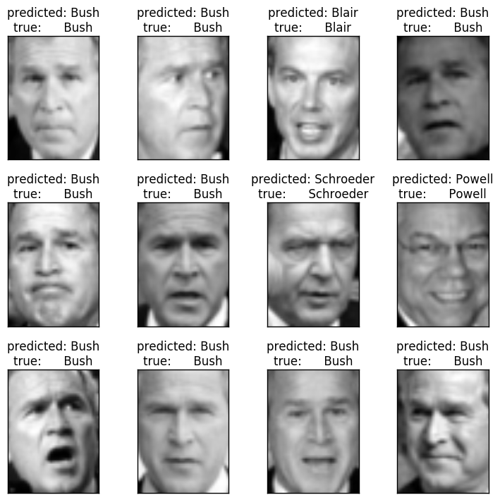
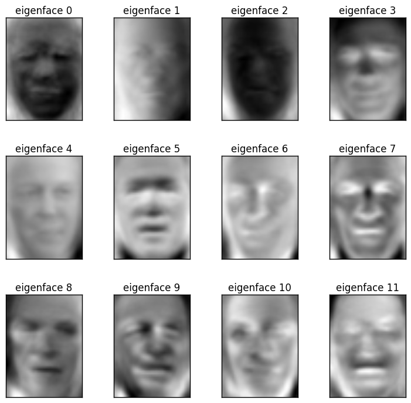

### PCA Mini-Project

#### PCA in Sklearn
The projection step of PCA can be easiest to understand when you subtract out the mean shift of the new principal components, so the new and old dimensions have the same mean:



```python

# The function doPCA should take data as an argument

def doPCA():
    from sklearn.decomposition import PCA
    pca = PCA(n_components = 2)  #number of PCs
    pca.fit(data)
    return pca

pca = doPAC()
# get information out of PCA
print pca.explained_variance_ratio_ #know the first PC has about 90% variance, etc.
first_pc = pca.components_[0]  #components is a list of PCs
second_pc = pca.components_[1]

transformed_data = pca.transform(data)

# visualizing it
for ii, jj in zip(transformed_data, data):
    plt.scatter( first_pc[0]*ii[0], first_pc[1]*ii[0], color = 'r') # x prime in the xy original system
    plt.scatter( second_pc[0]*ii[1], second_pc[1]*ii[1], color = 'c')
    plt.scatter( jj[0], jj[1], color = 'b')

plt.xlabel('bonus')
plt.ylabel('long-term incentive')
plt.show()
```


```python
"""
===================================================
Faces recognition example using eigenfaces and SVMs
===================================================

The dataset used in this example is a preprocessed excerpt of the
"Labeled Faces in the Wild", aka LFW_:

  http://vis-www.cs.umass.edu/lfw/lfw-funneled.tgz (233MB)

  .. _LFW: http://vis-www.cs.umass.edu/lfw/

  original source: http://scikit-learn.org/stable/auto_examples/applications/face_recognition.html

"""


print __doc__

from time import time
import logging
import pylab as pl
import numpy as np

from sklearn.cross_validation import train_test_split
from sklearn.datasets import fetch_lfw_people
from sklearn.grid_search import GridSearchCV
from sklearn.metrics import classification_report
from sklearn.metrics import confusion_matrix
from sklearn.decomposition import RandomizedPCA
from sklearn.svm import SVC

# Display progress logs on stdout
logging.basicConfig(level=logging.INFO, format='%(asctime)s %(message)s')


###############################################################################
# Download the data, if not already on disk and load it as numpy arrays
lfw_people = fetch_lfw_people(min_faces_per_person=70, resize=0.4)

# introspect the images arrays to find the shapes (for plotting)
n_samples, h, w = lfw_people.images.shape
np.random.seed(42)
```


    ===================================================
    Faces recognition example using eigenfaces and SVMs
    ===================================================

    The dataset used in this example is a preprocessed excerpt of the
    "Labeled Faces in the Wild", aka LFW_:

      http://vis-www.cs.umass.edu/lfw/lfw-funneled.tgz (233MB)

      .. _LFW: http://vis-www.cs.umass.edu/lfw/

      original source: http://scikit-learn.org/stable/auto_examples/applications/face_recognition.html


    2018-01-07 21:13:48,288 Loading LFW people faces from C:\Users\Liang Sun\scikit_learn_data\lfw_home


```python

# for machine learning we use the data directly (as relative pixel
# position info is ignored by this model)
X = lfw_people.data
n_features = X.shape[1]

# the label to predict is the id of the person
y = lfw_people.target
target_names = lfw_people.target_names
n_classes = target_names.shape[0]

print "Total dataset size:"
print "n_samples: %d" % n_samples
print "n_features: %d" % n_features
print "n_classes: %d" % n_classes


###############################################################################
# Split into a training and testing set
X_train, X_test, y_train, y_test = train_test_split(X, y, test_size=0.25, random_state=42)

###############################################################################
# Compute a PCA (eigenfaces) on the face dataset (treated as unlabeled
# dataset): unsupervised feature extraction / dimensionality reduction
n_components = 150

print "Extracting the top %d eigenfaces from %d faces" % (n_components, X_train.shape[0])
t0 = time()
pca = RandomizedPCA(n_components=n_components, whiten=True).fit(X_train)
print "done in %0.3fs" % (time() - t0)

eigenfaces = pca.components_.reshape((n_components, h, w))

print "Projecting the input data on the eigenfaces orthonormal basis"
t0 = time()
X_train_pca = pca.transform(X_train)
X_test_pca = pca.transform(X_test)
print "done in %0.3fs" % (time() - t0)


###############################################################################
# Train a SVM classification model

print "Fitting the classifier to the training set"
t0 = time()
param_grid = {
         'C': [1e3, 5e3, 1e4, 5e4, 1e5],
          'gamma': [0.0001, 0.0005, 0.001, 0.005, 0.01, 0.1],
          }
# for sklearn version 0.16 or prior, the class_weight parameter value is 'auto'
clf = GridSearchCV(SVC(kernel='rbf', class_weight='balanced'), param_grid)
clf = clf.fit(X_train_pca, y_train)
print "done in %0.3fs" % (time() - t0)
print "Best estimator found by grid search:"
print clf.best_estimator_


###############################################################################
# Quantitative evaluation of the model quality on the test set

print "Predicting the people names on the testing set"
t0 = time()
y_pred = clf.predict(X_test_pca)
print "done in %0.3fs" % (time() - t0)

print classification_report(y_test, y_pred, target_names=target_names)
print confusion_matrix(y_test, y_pred, labels=range(n_classes))


###############################################################################
# Qualitative evaluation of the predictions using matplotlib

def plot_gallery(images, titles, h, w, n_row=3, n_col=4):
    """Helper function to plot a gallery of portraits"""
    pl.figure(figsize=(1.8 * n_col, 2.4 * n_row))
    pl.subplots_adjust(bottom=0, left=.01, right=.99, top=.90, hspace=.35)
    for i in range(n_row * n_col):
        pl.subplot(n_row, n_col, i + 1)
        pl.imshow(images[i].reshape((h, w)), cmap=pl.cm.gray)
        pl.title(titles[i], size=12)
        pl.xticks(())
        pl.yticks(())


# plot the result of the prediction on a portion of the test set

def title(y_pred, y_test, target_names, i):
    pred_name = target_names[y_pred[i]].rsplit(' ', 1)[-1]
    true_name = target_names[y_test[i]].rsplit(' ', 1)[-1]
    return 'predicted: %s\ntrue:      %s' % (pred_name, true_name)

prediction_titles = [title(y_pred, y_test, target_names, i)
                         for i in range(y_pred.shape[0])]

plot_gallery(X_test, prediction_titles, h, w)

# plot the gallery of the most significative eigenfaces

eigenface_titles = ["eigenface %d" % i for i in range(eigenfaces.shape[0])]
plot_gallery(eigenfaces, eigenface_titles, h, w)

pl.show()

```

    Total dataset size:
    n_samples: 1288
    n_features: 1850
    n_classes: 7
    Extracting the top 150 eigenfaces from 966 faces
    done in 0.122s
    Projecting the input data on the eigenfaces orthonormal basis
    done in 0.019s
    Fitting the classifier to the training set
    done in 13.996s
    Best estimator found by grid search:
    SVC(C=1000.0, cache_size=200, class_weight='balanced', coef0=0.0,
      decision_function_shape=None, degree=3, gamma=0.001, kernel='rbf',
      max_iter=-1, probability=False, random_state=None, shrinking=True,
      tol=0.001, verbose=False)
    Predicting the people names on the testing set
    done in 0.041s
                       precision    recall  f1-score   support

         Ariel Sharon       0.56      0.69      0.62        13
         Colin Powell       0.72      0.83      0.78        60
      Donald Rumsfeld       0.70      0.70      0.70        27
        George W Bush       0.89      0.88      0.89       146
    Gerhard Schroeder       0.79      0.88      0.83        25
          Hugo Chavez       0.90      0.60      0.72        15
           Tony Blair       0.93      0.69      0.79        36

          avg / total       0.83      0.82      0.82       322

    [[  9   0   3   1   0   0   0]
     [  1  50   1   7   0   1   0]
     [  3   2  19   3   0   0   0]
     [  2  10   2 129   3   0   0]
     [  0   1   0   1  22   0   1]
     [  0   3   0   1   1   9   1]
     [  1   3   2   3   2   0  25]]








#### PCA Mini-Project

Our discussion of PCA spent a lot of time on theoretical issues, so in this mini-project we’ll ask you to play around with some sklearn code. The eigenfaces code is interesting and rich enough to serve as the testbed for this entire mini-project.

The starter code can be found in pca/eigenfaces.py. This was mostly taken from the example found here, on the sklearn documentation.

Take note when running the code, that there are changes in one of the parameters for the SVC function called on line 94 of pca/eigenfaces.py. For the 'class_weight' parameter, the argument string "auto" is a valid value for sklearn version 0.16 and prior, but will be depreciated by 0.19. If you are running sklearn version 0.17 or later, the expected argument string should be "balanced". If you get an error or warning when running pca/eigenfaces.py, make sure that you have the correct argument on line 98 that matches your installed version of sklearn.

#### Explained Variance of Each PC

We mentioned that PCA will order the principal components, with the first PC giving the direction of maximal variance, second PC has second-largest variance, and so on. How much of the variance is explained by the first principal component? The second?


We found that sometimes the pillow module (which is being used in this example) can cause trouble. If you get an error related to the fetch_lfw_people() command, try the following:

pip install --upgrade PILLOW

If you run into a different error, note that there are changes in one of the parameters for the SVC function called on line 94 of **pca/eigenfaces.py**. For the 'class_weight' parameter, the argument string "auto" is a valid value for sklearn version 0.16 and prior, but will be depreciated by 0.19. If you are running sklearn version 0.17 or later, the expected argument string should be "balanced". If you get an error or warning when running **pca/eigenfaces.py**, make sure that you have the correct argument on line 98 that matches your installed version of sklearn.


```python
pca.explained_variance_ratio_
```


    array([ 0.19346361,  0.15116848,  0.07083635,  0.05952005,  0.05157536,
            0.02887197,  0.02514493,  0.02176448,  0.02019352,  0.01902112,
            0.01682188,  0.0158062 ,  0.01223357,  0.01087943,  0.0106444 ,
            0.00979658,  0.0089241 ,  0.0085485 ,  0.00835738,  0.00722657,
            0.00696581,  0.00653869,  0.0063956 ,  0.00561312,  0.00531102,
            0.00520163,  0.0050747 ,  0.00484213,  0.00443595,  0.00417821,
            0.00393694,  0.00381731,  0.00356076,  0.00351191,  0.00334556,
            0.00329938,  0.00314638,  0.00296215,  0.00290127,  0.00284711,
            0.00279987,  0.00267544,  0.00259904,  0.0025838 ,  0.00240922,
            0.00238994,  0.00235418,  0.00222583,  0.00217506,  0.00216561,
            0.00209062,  0.00205427,  0.00200427,  0.00197382,  0.00193834,
            0.00188755,  0.00180168,  0.0017889 ,  0.00174819,  0.00173049,
            0.00165648,  0.00162947,  0.00157419,  0.0015342 ,  0.00149969,
            0.00147251,  0.00143909,  0.00141875,  0.00139689,  0.00138139,
            0.00133992,  0.0013316 ,  0.00128794,  0.00125577,  0.00124236,
            0.00121856,  0.00120941,  0.00118279,  0.00115079,  0.00113638,
            0.00112581,  0.00111595,  0.00109369,  0.00107118,  0.00105646,
            0.0010432 ,  0.00102372,  0.00101671,  0.0009975 ,  0.00096301,
            0.00094191,  0.00091909,  0.00091242,  0.00089124,  0.00087127,
            0.00086189,  0.00084263,  0.00083824,  0.00082796,  0.00080227,
            0.00078578,  0.00078125,  0.00075589,  0.00075113,  0.00074594,
            0.00073315,  0.00072901,  0.00071412,  0.00070433,  0.0006946 ,
            0.00066701,  0.00066204,  0.0006531 ,  0.00063477,  0.00063452,
            0.00062275,  0.00061385,  0.00060798,  0.00059879,  0.00059015,
            0.00057831,  0.00057158,  0.00056326,  0.00055927,  0.00054465,
            0.0005364 ,  0.00052819,  0.00051677,  0.00050816,  0.00050587,
            0.00050297,  0.000489  ,  0.00048117,  0.00047172,  0.00046351,
            0.00045969,  0.00045616,  0.00044619,  0.00044104,  0.00043224,
            0.00042921,  0.00042433,  0.00041858,  0.00041252,  0.00040051,
            0.00039733,  0.00039123,  0.00038895,  0.00037575,  0.00037326])


19.35% of the variance is explained by the first principal component. 15.12% by the second.

#### How Many PCs to Use?

Now you'll experiment with keeping different numbers of principal components. In a multiclass classification problem like this one (more than 2 labels to apply), accuracy is a less-intuitive metric than in the 2-class case. Instead, a popular metric is the F1 score.

We’ll learn about the F1 score properly in the lesson on evaluation metrics, but you’ll figure out for yourself whether a good classifier is characterized by a high or low F1 score. You’ll do this by varying the number of principal components and watching how the F1 score changes in response.

As you add more principal components as features for training your classifier, do you expect it to get better or worse performance?


```python
from sklearn.metrics import f1_score
f1_score(y_test, y_pred, average = 'weighted')
```


    0.83708891579865241


While ideally, adding components should provide us additional signal to improve our performance, it is possible that we end up at a complexity where we overfit.

The F1 score can be interpreted as a weighted average of the precision and recall, where an F1 score reaches its best value at 1 and worst score at 0. The relative contribution of precision and recall to the F1 score are equal. The formula for the F1 score is:

```
F1 = 2 * (precision * recall) / (precision + recall)
```

http://scikit-learn.org/stable/modules/generated/sklearn.metrics.f1_score.html

#### F1 Score vs. No. of PCs Used

Change n_components to the following values: [10, 15, 25, 50, 100, 250]. For each number of principal components, note the F1 score for Ariel Sharon. (For 10 PCs, the plotting functions in the code will break, but you should be able to see the F1 scores.) If you see a higher F1 score, does it mean the classifier is doing better, or worse?

Answer:  

Just change the n_components in the command above and check f1_score again.

Increasing n_components leads to lower f1_score. Higher F1 score means better!


```python
# for example, n_components = 250

f1_score(y_test, y_pred, average = 'weighted')
```


    0.82656268248918596


#### Dimensionality Reduction And Overfitting
Do you see any evidence of overfitting when using a large number of PCs? Does the dimensionality reduction of PCA seem to be helping your performance here?

Answer: the F1 score starts to drop when using a large number of PCs, which is an evidence of overfitting.

#### Selecting Principal Components

What's a good way to figure out how many PCs to use?

Train on different number of PCs, and see how accuracy responds -- cut off when it becomes apparent that adding more PCs doesn't buy you much more discrimination.
